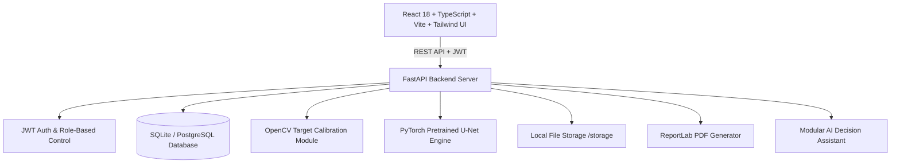

# WoundAI - Full-Stack AI Wound Segmentation & Healing Monitoring Platform

A production-grade web application for automated wound segmentation, calibration-based surface area measurement, and longitudinal wound healing progress tracking.

**Live Demo (Frontend):** https://sivaneerajkadagala-hub.github.io/Woundproject/

> Note: GitHub Pages hosts the frontend only. For full functionality (login, API, data), run the FastAPI backend locally or host it separately.

---

## 1. System Architecture



---

## 2. Core Features

* **JWT Authentication & RBAC**: Roles (`Admin`, `Clinician`, `Staff`). Pre-seeded demo account: `admin@woundai.local` / `Admin123!`.
* **Clinical Dashboard**: Summary cards for Total Patients, Active Wounds, Weekly Assessments, Improving Trajectories, and Attention-Required cases.
* **Synthetic Patient Directory**: Uses synthetic IDs (`PAT-1001`, `PAT-1002`) and non-PHI records.
* **Wound Case Management**: Tracks wound cases by anatomical location (*Left lower leg*, *Right foot*, *Heel*) and clinical category (*Venous Ulcer*, *Diabetic Foot Ulcer*, *Pressure Injury*).
* **Interactive Image Upload**: Drag-and-drop uploader supporting JPG and PNG format validation up to 20MB.
* **OpenCV Marker Calibration Engine**:
  - Automatically detects circular/rectangular calibration targets (e.g. 10mm target).
  - Manual fallback allowing user-specified marker endpoints or pixel dimension inputs.
* **Pretrained PyTorch U-Net Segmentation**:
  - Pretrained U-Net (`segmentation-models-pytorch` with ResNet/EfficientNet encoder).
  - Generates probabilistic wound maps, confidence scores, binary wound masks, and transparent yellow/red highlights overlays.
* **Mathematically Precise Area Calculation**:
  - Linear Scale: $s = \frac{\text{known\_size\_mm}}{\text{marker\_size\_px}}$
  - Wound Area: $\text{Area}_{\text{mm}^2} = N_{\text{pixels}} \times s^2$
  - Surface Area ($\text{cm}^2$): $\text{Area}_{\text{cm}^2} = \frac{\text{Area}_{\text{mm}^2}}{100}$
* **Longitudinal Progress Tracking**: Recharts trajectory line graphs showing area reduction over sequential visits (e.g., $320\text{ mm}^2 \to 275\text{ mm}^2 \to 230\text{ mm}^2 \to 195\text{ mm}^2 = -39\%$).
* **Side-by-Side Comparison**: Compare any two visits visual overlays and quantitative metrics side-by-side.
* **PDF Report Generation**: Clinical summary documents formatted with ReportLab containing patient metadata, image thumbnails, mask overlay, quantitative metrics, clinician notes, and medical disclaimer.
* **AI Decision Support Assistant**: Modular conversational assistant for summarizing visit history and structuring notes.

---

## 3. Technology Stack

### Frontend
* React 18, TypeScript, Vite
* Tailwind CSS, Lucide React icons
* Recharts, Axios, React Hook Form, Zod

### Backend
* Python 3.11+, FastAPI, Uvicorn
* SQLAlchemy ORM, Alembic migrations
* PyJWT, bcrypt password hashing
* ReportLab PDF Generator

### AI / Computer Vision
* PyTorch, `segmentation-models-pytorch` (Pretrained U-Net)
* OpenCV (`opencv-python-headless`), Pillow, NumPy

### Database & Storage
* SQLite (Local Zero-Config) / PostgreSQL 15 (Docker)
* Local File Storage (`/storage/images`, `/storage/masks`, `/storage/overlays`, `/storage/reports`)

---

## 4. Quick Start (Local Development)

### Backend Setup
```bash
cd backend
python -m venv venv
# Windows:
venv\Scripts\activate
# Linux/macOS:
source venv/bin/activate

pip install -r requirements.txt
uvicorn app.main:app --reload --port 8000
```
Backend API interactive documentation available at: `http://localhost:8000/docs`

### Frontend Setup
```bash
cd frontend
npm install
npm run dev
```
Access the application at: `http://localhost:5173`

---

## 5. Docker Deployment

Run the complete multi-container stack (PostgreSQL + FastAPI + Nginx Frontend):
```bash
docker compose up --build
```
* **Frontend UI**: `http://localhost:3000`
* **FastAPI Backend**: `http://localhost:8000`
* **API Documentation**: `http://localhost:8000/docs`

---

## 6. Demo Credentials

* **Email**: `admin@woundai.local`
* **Password**: `Admin123!`
* **Role**: Admin / Primary Clinician

---

## 7. Medical Disclaimer

> **IMPORTANT**: This application is a decision-support demonstration prototype. Automated measurements and computer vision U-Net outputs must be reviewed by a qualified healthcare professional prior to clinical decision-making. De-identified synthetic data only.
